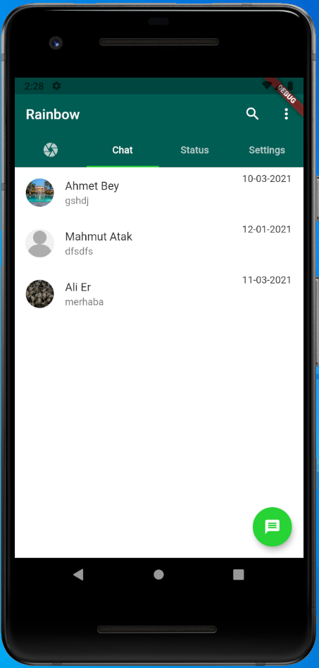
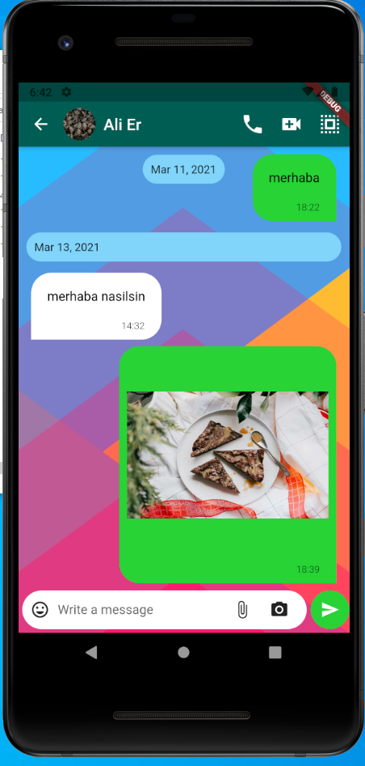

# RAINBOW
This is real time chat app example.
# Project Overview

This project is the graduation project of the Necmettin Erbakan University Computer Engineering department. The aim of the project is to allow users to send messages to each other and transmit media files in real time. Moreover, while performing these operations, it is aimed that only users can see these messages. In other words, messages are stored and transmitted encrypted.

# My Goal

To meet with current technology, flutter and firebase after mobile coding experience with Java. We know that Flutter has a flexible and easy structure for mobile development. Learning the widgets in Flutter will enable me to develop the applications that I will develop in the next step. It is also a great advantage to be able to develop cross-platform applications with Flutter. Thanks to the service structure created between Flutter and firebase, I will understand the firebase structure (Authentication, Cloud Firestore, Storage). In this way, I can easily use firebase in my other front-end applications.

# Project Technologies

[Flutter](https://flutter.dev)

[Firebase](https://firebase.google.com/)

# Project Details

Mobile Authentication Screen / Verification Screen

User Register Screen / Conversations Screen

Conversation Screen / Conversation Detail Screen

Conversation Selection Mode Screen / Message Delete Screen

Image Download Gallary / Start Conversation From Contacts

Start Group Conversation

Settings Screen / Profile Settings Screen

Status Set Screen 

